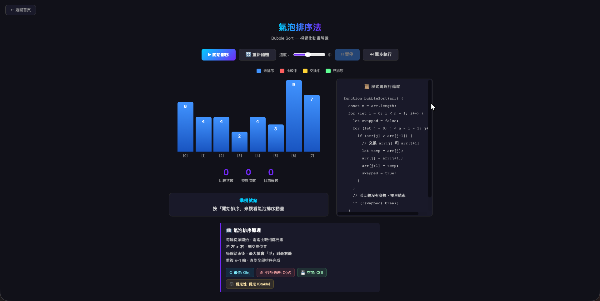

# 排序演算法分析報告

學號：11428211  
姓名：鐘茝翔  
模擬頁面：[https://kentchung329.github.io/sort_report/](https://kentchung329.github.io/sort_report/)  

---

## 一、前言

在計算機科學中，排序演算法（Sorting Algorithm）是資料結構與演算法的基礎。不同的排序邏輯在處理不同規模、不同亂度的資料時，會展現出截然不同的效能。本報告旨在探討五種經典的排序演算法：氣泡排序、選擇排序、插入排序、合併排序與快速排序。

為求深入理解，本報告不僅包含理論層面的原理與複雜度分析，更親自實作了「視覺化模擬網頁」以觀察演算法運作時的記憶體資料搬移過程；同時透過程式撰寫測試腳本，實際量測各演算法在不同資料規模（n）下的執行時間，藉此驗證理論複雜度與實務效能的關聯性。

  
   <i>圖 1：本報告專屬之視覺化排序模擬頁面</i>

---

## 二、排序法原理與操作方式

### 1. 氣泡排序法 (Bubble Sort)
- **原理簡述**：透過相鄰元素兩兩比較，若前一個元素比後一個元素大，就交換兩者位置。每一輪比較後，當前未排序區間的最大值會逐漸往右移動，如同氣泡上浮至水面。
- **操作方式**：重複執行 n-1 輪，每輪從頭開始比較相鄰元素。在視覺化模擬中，可觀察到較高的柱狀圖會穩定地向右側（已排序區）推進。

### 2. 選擇排序法 (Selection Sort)
- **原理簡述**：每一輪從尚未排序的資料區間中「搜尋最小值」，並將該最小值與目前未排序區間的第一個元素進行交換。
- **操作方式**：此方法的特色是「交換次數少」。在模擬畫面中，會看到系統先掃描剩餘區間找到最低點，然後直接與左側目標位置互換，每輪僅執行一次交換。

### 3. 插入排序法 (Insertion Sort)
- **原理簡述**：將資料分為「已排序區」與「未排序區」。每次從未排序區取第一個元素，由後往前與已排序區的元素比較，找到合適的大小位置後插入，如同打撲克牌時整理手牌的動作。
- **操作方式**：從第二個元素開始，若前方元素較大則將前方元素向右平移，騰出空間後插入新值。

### 4. 合併排序法 (Merge Sort)
- **原理簡述**：採用分治法（Divide and Conquer）。將原始陣列不斷對半遞迴分割，直到每個子陣列只剩一個元素（視為已排序），再將這些小陣列兩兩合併成較大的已排序陣列，直到還原為單一陣列。
- **操作方式**：此方法需額外配置記憶體空間來暫存合併結果。在視覺化模擬中，可明顯觀察到資料被拆分成多個小區塊後，再依序合併還原的過程。

### 5. 快速排序法 (Quick Sort)
- **原理簡述**：同樣基於分治法。從陣列中挑選一個「基準值（Pivot）」，將小於基準值的元素放到左邊，大於的放到右邊。接著對左右兩側的子陣列遞迴重複此步驟。
- **操作方式**：不需要額外的大量陣列空間（In-place），透過指標交換即可完成分區（Partition）。這是實務上應用最廣泛、平均效能極佳的排序法。

---

## 三、複雜度分析

針對上述五種演算法，其時間複雜度（Time Complexity）、空間複雜度（Space Complexity）與穩定性分析彙整如下：

| 排序演算法 | 最佳時間複雜度 | 平均時間複雜度 | 最差時間複雜度 | 空間複雜度 | 穩定性 |
| :--- | :---: | :---: | :---: | :---: | :---: |
| **氣泡排序** | O(n) *註1* | O(n²) | O(n²) | O(1) | ✅ 穩定 |
| **選擇排序** | O(n²) | O(n²) | O(n²) | O(1) | ❌ 不穩定 |
| **插入排序** | O(n) | O(n²) | O(n²) | O(1) | ✅ 穩定 |
| **合併排序** | O(n log n) | O(n log n) | O(n log n) | O(n) | ✅ 穩定 |
| **快速排序** | O(n log n) | O(n log n) | O(n²) *註2* | O(log n) *註3*| ❌ 不穩定 |

**【複雜度重要備註】：**
* **註 1**：氣泡排序的最佳情況 O(n) 成立前提是「程式碼內有實作提前中斷（Flag）機制」，若當前回合完全沒有發生交換，代表已排序完成，可提早結束。
* **註 2**：快速排序的最差情況發生在「資料已排好序」且「基準值（Pivot）總是選到最大或最小值」時，會導致無法有效對半分切，退化成 O(n²)。
* **註 3**：快速排序的空間複雜度主要來自於「遞迴呼叫堆疊（Recursion Stack）」。平均情況下樹高為 O(log n)；但在最差情況下（極端偏斜樹），空間複雜度會退化至 O(n)。

---

## 四、實驗設計

為驗證上述理論之時間複雜度，本報告額外撰寫了 Python 測試腳本進行實際的效能量測。
1. **測試環境**：使用 Python 內建函式庫計算演算法執行耗時。
2. **資料生成**：使用隨機亂數產生器（Random），範圍介於整數 1 ~ 100,000 之間，模擬完全無序的真實資料狀態。
3. **樣本規模 (n)**：設計三種不同級距的資料量，分別為 **N = 1,000**、**N = 5,000** 與 **N = 10,000**，以觀察資料量增長時，耗時的非線性變化。
4. **實驗控制**：為避免系統背景程式干擾導致誤差，每個演算法在每個級距皆**執行 3 次並取平均值**，單位為秒（s）。

---

## 五、結果呈現與比較

實測執行時間（秒）整理如下表：

| 樣本規模 (N) | 氣泡排序 O(n²) | 選擇排序 O(n²) | 插入排序 O(n²) | 合併排序 O(n log n) | 快速排序 O(n log n) |
| :---: | :---: | :---: | :---: | :---: | :---: |
| **N = 1,000** | 0.128 秒 | 0.058 秒 | 0.057 秒 | 0.005 秒 | 0.004 秒 |
| **N = 5,000** | 2.581 秒 | 1.247 秒 | 1.424 秒 | 0.032 秒 | 0.022 秒 |
| **N = 10,000** | 10.325 秒 | 4.789 秒 | 4.873 秒 | 0.049 秒 | 0.038 秒 |

  
   <i>圖 2：五種排序演算法執行時間隨 N 增加之趨勢圖</i>

**【效能差異比較與觀察】：**
1. **複雜度曲線的具象化**：
   從上方折線圖可直觀看出，隨著 N 從 1,000 增長至 10,000，屬於 O(n²) 的氣泡、選擇與插入排序，其執行時間呈現指數型態（拋物線）急遽上升；反觀屬於 O(n log n) 的合併與快速排序，其時間增長曲線極度平緩，幾乎貼近 X 軸。這完美具象化了時間複雜度在面對大數據時的決定性影響。
2. **O(n²) 基礎排序的極限**：
   觀察氣泡、選擇與插入排序，當資料量變成 2 倍（從 5,000 到 10,000）時，執行時間大約增加了 2² = 4 倍（例如氣泡排序從 2.5 秒暴增至 10.3 秒）。這驗證了 O(n²) 面對資料增長時效能衰退嚴重的缺點。
3. **同為 O(n²) 內部的微小差異**：
   實測數據中，選擇排序與插入排序的耗時明顯低於氣泡排序（幾乎只有一半）。這是因為氣泡排序包含了大量的「記憶體資料交換」操作，而選擇排序每輪只交換一次，這在實務硬體執行上會帶來一定的效能優勢。

---

## 六、心得與結論

透過本次的排序演算法報告，我不僅從理論上釐清了五種排序法的運作邏輯，更透過「視覺化網頁實作」與「程式效能實測」，深刻體會到演算法對程式效能的巨大影響。

在視覺化實作過程中，將抽象的變數狀態轉換成動畫是一大挑戰，尤其是**合併排序**與**快速排序**這兩種依賴遞迴（Recursion）的演算法。我必須在腦中清楚模擬遞迴堆疊（Stack）的進出狀態，這對我的程式邏輯訓練有非常大的幫助。

在數據模擬實驗中，我親眼見證了理論化為現實的震撼。同樣是一萬筆資料，氣泡排序需要花費十多秒，而快速排序卻能在眨眼間（不到 0.04 秒）完成。這讓我深刻明白，在日後實務開發面對龐大數據（如資料庫處理或大數據分析）時，為何多數現代程式語言底層皆採用改良版的快速排序或合併排序（如 TimSort）。

總結來說，這份作業讓我從單純的「背誦演算法」，進階到了「實作、量測並分析結果」的層次，也讓我學到了如何針對特定情境（如資料量大小、對穩定性的要求、記憶體限制）去選擇最適合的排序工具，是一次非常紮實且充滿成就感的學習報告。
